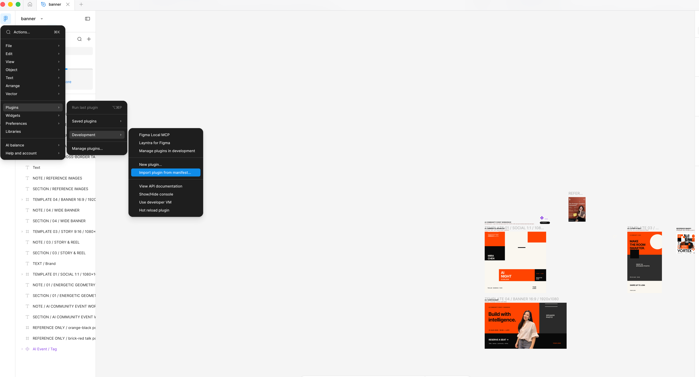

# 新手入门

这份指南不要求你懂插件开发。

## 安装

1. 安装 Node.js 20+、Codex Desktop 或 CLI，以及 Figma Desktop。
2. 克隆 Layntra，在仓库根目录运行 `./scripts/install.sh`。
3. 在 Figma Desktop 打开一个 Design 文件。公司 Dev/Collab/View seat 无法运行
   Design 插件时，个人 Starter 空间是免费路径。
4. 选择 **Plugins → Development → Import plugin from manifest…**。
5. 导入 `apps/figma-plugin/manifest.json`。



6. 运行 **Plugins → Development → Layntra for Figma**，保持状态窗口打开。
7. 新建 Codex 任务，让刚安装的插件被加载。

## 确认连接

```text
$layntra status
```

返回结果应显示 `connected`、当前文件、页面、选区和只读模式。否则先按故障排查
指南恢复，不要继续写入。

## 只检查、不修改

在 Figma 中选中一个 Frame，然后输入：

```text
$layntra inspect selection
不要修改 Figma。
```

返回结果必须以“尚未修改 Figma”结束。

## 创建第一个受控 Frame

```text
$layntra plan
范围：new-frame
创建 390 × 844 的注册页面，包含默认、加载和错误状态。
保留所有现有图层。
```

检查目标、拟创建图层、保留内容和节点数量。此时尚未写入。确认无误后输入：

```text
$layntra apply
```

确认 Figma 出现可以独立编辑的图层。Layntra 必须重新读取并汇报实际结果。立即
输入 `$layntra undo`，确认受保护的撤销生效，并让 Layntra 再次读取撤销后的文档。
关闭伴侣后，也可以使用 Figma 的 `Command + Z` 作为手动后备方案。

伴侣 manifest 始终位于 `apps/figma-plugin/manifest.json`，运行入口始终是
**Plugins → Development → Layntra for Figma**。
